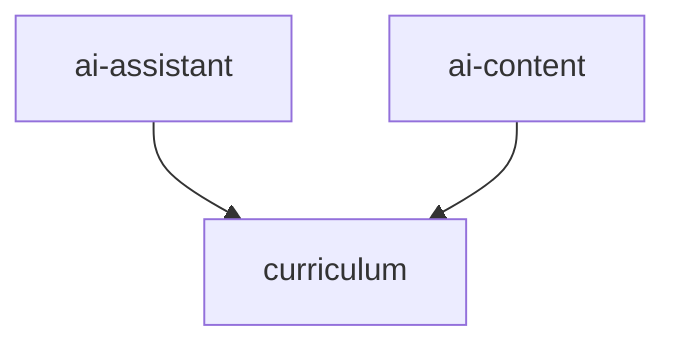

# Questerix Feature Fragility — Hardening Plan

> Generated from `questerix-cortex/outputs/FRAGILITY_MATRIX.md` and `FEATURE_MAP.md`
> Date: 2026-02-26

## Executive Summary

Cortex analysis identified **curriculum** as the single structural risk in the admin-panel codebase. With a fragility score of 25 (STIFF), it acts as the gravitational center of the codebase: 38 files, 83 exports, and 2 inbound feature dependencies (`ai-assistant` and `ai-content`).

Per **AGENTS.md Core Rule #5** (Admin Panel Feature Freeze), this plan documents **immediate maintenance-safe actions** and **post-freeze architectural improvements**.

---

## Current Fragility Rankings

| Rank | Feature        | Score | Verdict     | Files | Exports | In/Out |
| ---- | -------------- | ----- | ----------- | ----- | ------- | ------ |
| 1    | **curriculum** | 25    | 🟠 STIFF    | 38    | 83      | 2/0    |
| 2    | ai-assistant   | 6.5   | 🟡 MODERATE | 9     | 13      | 0/1    |
| 3    | auth           | 5     | ✅ STABLE   | 10    | 8       | 0/0    |
| 4    | platform       | 4.5   | ✅ STABLE   | 9     | 30      | 0/0    |
| 5    | monitoring     | 4     | ✅ STABLE   | 8     | 17      | 0/0    |
| 6    | mentorship     | 3     | ✅ STABLE   | 6     | 6       | 0/0    |
| 7    | ai-content     | 2.5   | ✅ STABLE   | 1     | 1       | 0/1    |
| 8    | dashboard      | 0.5   | ✅ STABLE   | 1     | 1       | 0/0    |

### Dependency Graph



---

## 🟠 curriculum (Score 25 — STIFF)

### Problem Statement

The `curriculum` feature is the **only inbound dependency target** in the entire codebase. Both AI features (`ai-assistant`, `ai-content`) depend on it transitively, making any curriculum change a potential breaking change for 25% of the admin-panel's AI surface.

**Root causes:**

1. **Oversized barrel export** — `index.ts` re-exports 13 modules with `export *`, creating 83-public-export surface
2. **Type coupling** — `types.ts` (16 type definitions) is imported directly by cross-feature consumers
3. **No interface boundaries** — Hooks like `use-domains`, `use-skills`, `use-questions` are only consumed internally, yet they're exported globally

### Immediate Actions (Maintenance-Safe)

These changes comply with AGENTS.md "bug fixes and maintenance only" rule:

#### H1: Narrow Barrel Exports

**File:** `admin-panel/src/features/curriculum/index.ts`

Replace `export *` spam with explicit named exports:

```typescript
// BEFORE: 13 export * statements, 83 exports
export * from "./components/domain-form";
export * from "./components/domain-list";
// ... etc

// AFTER: Only what's actually used cross-feature
export type { CurriculumStatus, PaginationParams } from "./types";
export { useDashboard } from "./hooks/use-dashboard";
// Components stay internal to curriculum pages
```

**Impact:** Reduces public API surface from 83 to ~20 exports. Breaking change for external consumers—document in commit.

#### H2: Extract Cross-Cutting Types

**File:** New `admin-panel/src/lib/curriculum-types.ts`

Move types that cross feature boundaries:

- `CurriculumStatus`
- `PaginationParams`
- `PaginatedResponse<T>`
- `QuestionType` and related option types

Update `ai-assistant/pages/GenerationPage.tsx` and `ai-content/pages/BulkImportPage.tsx` to import from `lib/curriculum-types` instead of `features/curriculum/types`.

**Impact:** Breaks the transitive dependency chain. `curriculum` can change internally without affecting AI features.

### Post-Freeze Actions (Requires Feature Freeze Lift)

These require directory restructuring and new feature creation:

#### H3: Split by Domain (Architectural)

Implement the guard rules already defined in `cortex.config.json`:

```json
{
  "name": "curriculum-core",
  "allowed": ["lib/**", "hooks/use-app"],
  "forbidden": ["features/curriculum-*"]
}
```

Split into:

- `curriculum-core`: Domain types, shared utilities
- `curriculum-domains`: Domain management
- `curriculum-governance`: Publishing workflow
- `curriculum-questions`: Question bank

#### H4: Add Export Count Guard

Add a CI check that fails if any feature's `index.ts` exports more than 50 symbols:

```yaml
- name: Check Barrel Export Limits
  run: |
    node scripts/check-export-limits.js --max-exports 50
```

---

## 🟡 ai-assistant (Score 6.5 — MODERATE)

### Problem Statement

Single outbound dependency to `curriculum`. `GenerationPage.tsx` imports curriculum types for AI question generation.

### Actions

#### H5: Document the Contract

Add explicit import comments:

```typescript
// GenerationPage.tsx
// CROSS-FEATURE IMPORT: Uses curriculum types for question generation
// If curriculum types change, this page may break
import type { QuestionType } from "@/features/curriculum/types";
```

#### H6: Pin the Import Surface (After H2)

Once `H2` (Extract Cross-Cutting Types) is done, update imports:

```typescript
// AFTER H2: Import from lib instead of feature
import type { QuestionType } from "@/lib/curriculum-types";
```

---

## ✅ Healthy Features (No Action Needed)

| Feature        | Why It's Healthy                                                                    |
| -------------- | ----------------------------------------------------------------------------------- |
| **auth**       | 0 in/out degree. 10 files, only 8 exports (0.8/file density). Ideal leaf module.    |
| **platform**   | Self-contained. 30 exports across 9 files is dense (3.3/file) but no coupling risk. |
| **monitoring** | Self-contained, no inbound or outbound dependencies.                                |
| **mentorship** | Small surface (6 files, 6 exports), no coupling.                                    |
| **ai-content** | Minimal (1 file, 1 export), single outbound to curriculum.                          |
| **dashboard**  | Minimal (1 file, 1 export), completely isolated.                                    |

---

## File-Level Fragility Gap

**Current state:** The `fragility` table in cortex-db is empty.

**Why:** The table is only populated when the `cortex_verify` MCP tool is called after file changes. Since no agent has used this workflow yet, there's no historical failure data.

**Recommendation:** Agents should call `cortex_verify` after every edit to build the historical dataset. This will enable the "Top 5 Fragile Files" report in `HEALTH_REPORT.md`.

---

## Implementation Priority

| Priority | Action                          | Effort | Blocked By          |
| -------- | ------------------------------- | ------ | ------------------- |
| 1        | H1: Narrow Barrel Exports       | 30 min | None                |
| 2        | H2: Extract Cross-Cutting Types | 45 min | None                |
| 3        | H6: Update AI imports           | 15 min | H2                  |
| 4        | H5: Document contracts          | 10 min | None                |
| 5        | H3: Split by Domain             | 2 days | Feature Freeze Lift |
| 6        | H4: Export Count Guard          | 1 hour | None                |

---

## Success Metrics

After implementation:

- `curriculum` fragility score < 15 (MODERATE or better)
- `FRAGILITY_MATRIX.md` shows 0 inbound dependencies to curriculum
- `HEALTH_REPORT.md` shows file-level fragility data (requires `cortex_verify` usage)
- No feature exceeds 50 public exports

---

## References

- `questerix-cortex/outputs/FRAGILITY_MATRIX.md` — Source rankings
- `questerix-cortex/outputs/FEATURE_MAP.md` — Dependency graph
- `admin-panel/src/features/curriculum/index.ts` — Barrel exports
- `cortex.config.json` — Guard rules (lines 23-45)
- `AGENTS.md` — Core Rule #5 (Feature Freeze)
